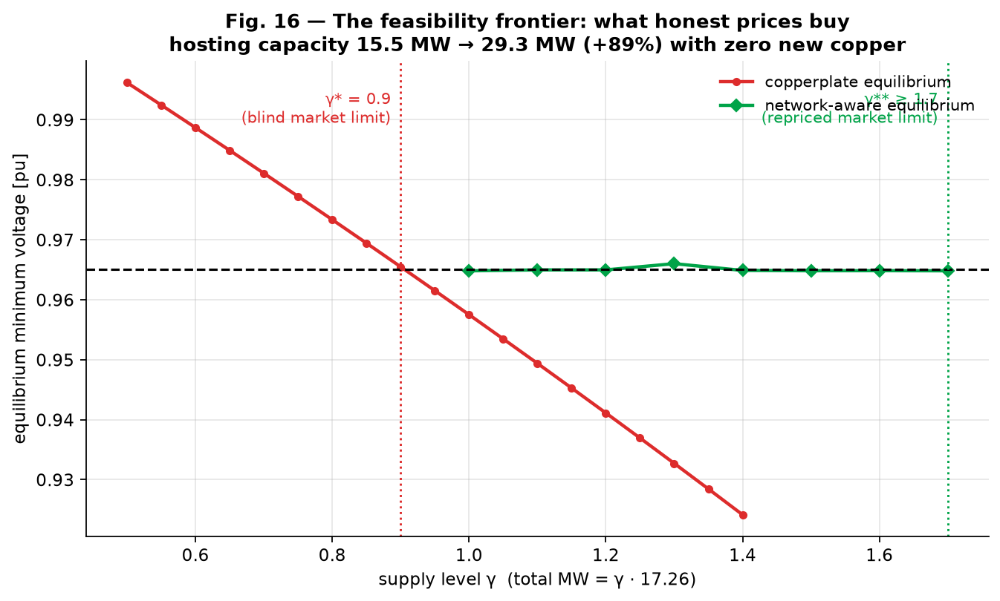
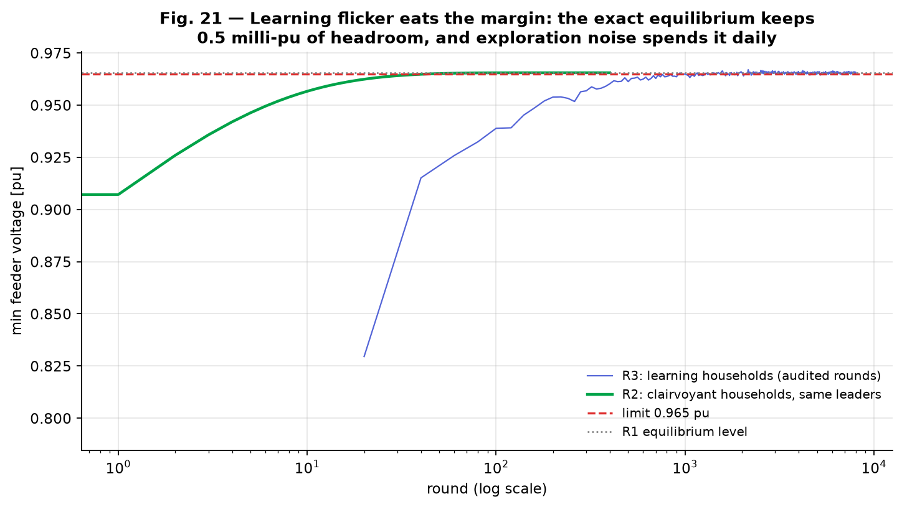
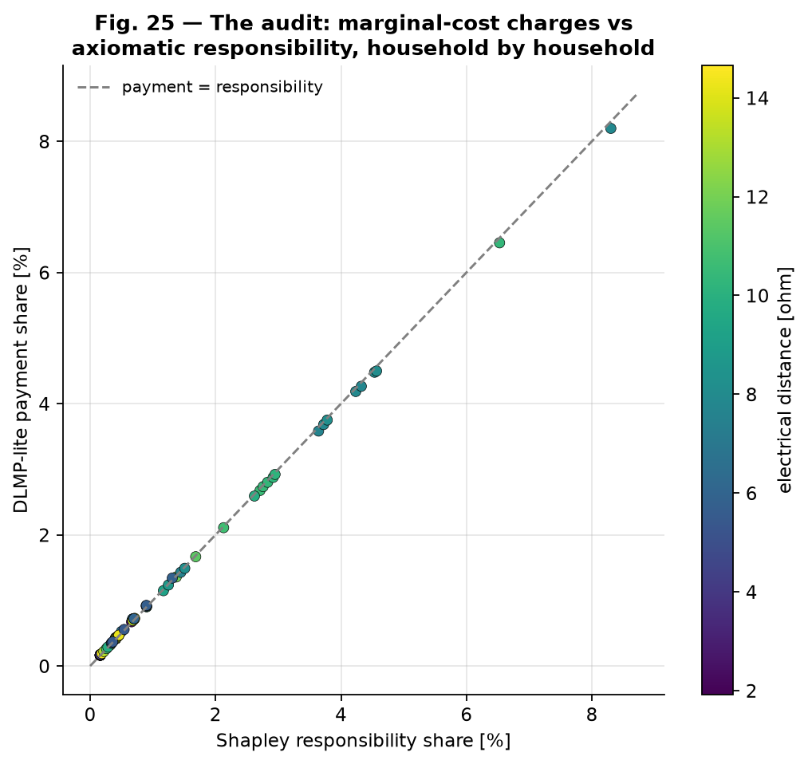

# stackelberg-dr-real-feeder

**What happens to game-theoretic demand response when the copperplate becomes a
real feeder?**

Game-theoretic demand response is almost always studied on a copperplate model —
energy flows from anyone to anyone, with no impedance, no voltage limits, no
location. This repository recreates the canonical Stackelberg demand-response
game, then confronts it, milestone by milestone, with the three things the
copperplate hides: **distribution-feeder physics** (every equilibrium and every
trajectory audited with AC power flow), **learning agents** (households that
know only their own experience), and **fairness** (who pays for the physics,
audited with Shapley attribution and repaired — including two repairs that fail
and are caught).

The method throughout: every layer is graded against the exact layer below it —
the recreation against its paper, the feeder market against AC power flow, the
learners against the analytical equilibrium, the fairness repairs against the
re-solved world. Negative results are kept and logged in [`LEDGER.md`](LEDGER.md).

| # | Question | Headline result |
|---|---|---|
| **M1** | Recreate the Stackelberg DR game of Maharjan *et al.* (2013) | Verified end to end; Figs. 4–8 reproduced quantitatively; the distributed algorithm is an integral controller on excess demand |
| **M2** | Put a real SimBench MV feeder under the game | Blind equilibria break physics above γ\*=0.9; per-bus dual-ascent repricing lifts hosting capacity **+89%** |
| **M3** | Replace clairvoyant households with model-free learners | The exact equilibrium is learnable from comfort feedback alone — but learning flicker permanently spends the voltage margin |
| **M4** | Who pays for the physics — and can every bill be explained? | Charges pass a Shapley cost-causation audit; two intuitive repairs fail measurably; the FTR-style rebate repairs (Jain 0.9999) |

**Ten-minute path for a first read:** the three figures below, then notebook 03
§5–6 (the repricing) and notebook 05 §4 (the repair experiments).

---

### Three figures that carry the argument

**The feasibility frontier (M2).** The copperplate equilibrium (red) crashes
through the voltage limit at γ\* = 0.9; network-aware repricing (green) rides
the limit to γ\*\* = 1.7 — hosting capacity 15.5 → 29.3 MW with zero new copper,
ending at a thermal wall no price can dodge.

**Learning occupies a neighborhood (M3).** Clairvoyant dynamics (green) settle
inside the limit and stay there; model-free learners (blue) reach the same
equilibrium but flicker across the limit forever — the exact equilibrium keeps
0.5 milli-pu of headroom and exploration noise spends it daily.

**The Shapley audit (M4).** Congestion payments vs. axiomatically attributed
responsibility (Monte-Carlo Shapley, AC-power-flow oracle), household by
household: the DLMP-style charges pass the cost-causation audit almost exactly —
which certifies the split and sharpens, rather than settles, the fairness
question.

---

## M1 — the recreation

> S. Maharjan, Q. Zhu, Y. Zhang, S. Gjessing, T. Başar, "Dependable Demand
> Response Management in the Smart Grid: A Stackelberg Game Approach,"
> *IEEE Trans. Smart Grid* 4(1), 2013. DOI:
> [10.1109/TSG.2012.2223766](https://doi.org/10.1109/TSG.2012.2223766)

⚠️ Independent, unofficial, educational recreation — see
[`DISCLAIMER.md`](DISCLAIMER.md). Not affiliated with or endorsed by the authors.

**Recreated and verified:** the closed-form follower best response (checked
against a numerical optimizer to ~10⁻⁵, corner cases included), the unique
positive Stackelberg equilibrium via the paper's linear system (sell-all and
budget identities hold to machine precision), the paper's Figs. 4–8
quantitatively (anchor tables in the notebook), and the distributed
price-adjustment algorithm — which converges to the analytical equilibrium using
local information only, with the gain-vs-stability trade-off of its σ parameter
mapped (the sufficient bound of the paper's Theorem 5 turns out to be the
practical tuning optimum).

**Honestly logged:** the paper's Figs. 9–10 are not reproducible from its stated
parameters (their converged demands are inconsistent with total supply);
Figs. 11–12 are. Details in [`LEDGER.md`](LEDGER.md).

## M2 — the game meets the feeder

The M1 game, unchanged, with its 96 households pinned to the buses of SimBench
`1-MV-rural--0-sw` (17.3 MW nameplate, 116 km of 20 kV line) and **every
equilibrium audited with AC power flow**:

- **The market clears; the feeder doesn't.** Above supply level γ\* = 0.9
  (15.5 MW) the unique Stackelberg equilibrium violates the 0.965 pu planning
  band — the game is structurally blind to the wire. Voltage binds first,
  thermal never does (rural signature).
- **The road to equilibrium is worse than the equilibrium:** price discovery
  transits dozens of iterations of voltage violation (worst 0.9155 pu) on its
  way to a perfectly feasible resting point — steady-state feasibility ≠
  trajectory feasibility.
- **DLMP-lite repricing restores feasibility through self-interest alone:**
  per-bus congestion adders found by projected dual ascent against AC-PF
  audits relocate (not ration) demand. A single global voltage constraint
  provably whack-a-moles between feeder branches — per-bus multipliers are
  necessary (negative result, kept).
- **Honest prices nearly double the hosting capacity:** 15.5 → 29.3 MW (+89%)
  with zero new copper, ending at a thermal wall no relocation can dodge.
- **The adders price responsibility, not remoteness** — the congested branch
  pays ~15× more than equally-remote healthy branches; the same budget buys
  ~7% less energy at the feeder end. Efficient ≠ fair: M4's opening question.

## M3 — learning the equilibrium

The clairvoyant households are replaced by **model-free bandit learners** — each
observes only posted prices, its own budget, and its own realized comfort (a
number, not a formula), and learns by perturb-and-observe (MPPT logic, as a
market strategy). Leaders keep the paper's Algorithm-2 integral control on a
slower timescale. Multi-seed, AC-PF audited:

- **The equilibrium is learnable from comfort feedback alone:** 96 learners +
  3 adaptive leaders converge to the exact Stackelberg equilibrium (median
  1.8% price error, 3.3 kW/household over 6 seeds) — ~100× slower than
  clairvoyant dynamics, and to a stochastic neighborhood, never a point.
- **The two nested loops obey cascade-control rules:** sluggish leaders never
  arrive; eager leaders chase exploration noise and amplify it (~8× price
  jitter). *Who updates when* is a measured design variable.
- **Learning flicker spends the safety margin:** the trajectory violates the
  voltage limit on 120 of 400 audited rounds (worst 0.83 pu) and keeps
  flickering after "converging." Equilibrium analysis certifies a point;
  learning occupies a neighborhood.
- **DLMP-lite prices steer learners correctly but leave zero margin:** under
  frozen network-aware adders the learners find the repriced equilibrium yet
  cross the limit on 311 of 400 rounds — static efficiency and
  robustness-to-learning are in direct tension (open research question).

## M4 — the fairness ledger and Shapley attribution

At the γ=1.1 network-priced equilibrium, the congested branch (23 of 96
households) surrenders **28.7% of its budget** in congestion charges; the rest
pays ~5%:

- **The charges pass a Shapley cost-causation audit.** Monte-Carlo Shapley
  attribution of the constraint pressure (shadow-price-weighted voltage
  depression, ~10⁴ AC power flows, MC stderr ~0.3%) matches the payment shares
  to within 0.1 percentage points — on a near-linear feeder, marginal charging
  ≈ axiomatic responsibility. The split is certified; the policy question
  (cost-causation = location discrimination when "causing" means living on the
  weak branch) is sharpened, not settled.
- **Shapley doubles as the per-household bill explanation** — charge vs.
  audited responsibility ± sampling error: a concrete XAI/transparency
  artifact.
- **Two of three repairs fail — and the failures are caught, not assumed.**
  Rebating the congestion revenue into budgets *worsens* fairness (Jain
  0.983 → 0.970, +31% rebound: in a sell-all market rebates are price
  inflation, and the branch's rebate re-excites its own constraint). An equal
  dividend fails even as outside money (it targets the *small*; the congested
  branch hosts the *large* consumers). The FTR-style pro-rata rebate — each
  household's own congestion payment returned infra-marginally — repairs the
  ledger: Jain 0.9999, zero rebound, physics untouched, caveats stated.
- **The learning tax is location-biased too:** the congested branch pays ~2×
  the regret of the rest while learning (7.0% vs 3.4% of equilibrium utility).
  The weak branch pays three times: charges, purchasing power, regret.

## Reading order

| Notebook | Content |
|---|---|
| [`01_from_dispatch_to_games`](notebooks/01_from_dispatch_to_games.ipynb) | Game theory from scratch for a power engineer: Nash via a 2-EV/1-transformer game, best-response dynamics as Gauss–Seidel, price of anarchy, a congestion toll that makes selfishness optimal, Stackelberg leadership, and why best-response dynamics can hunt or diverge |
| [`02_maharjan2013_recreation`](notebooks/02_maharjan2013_recreation.ipynb) | M1: the faithful recreation — model extraction, verification, reproduction of the paper's figures, the distributed algorithm as an integral controller, the recreation scorecard |
| [`03_the_game_meets_the_feeder`](notebooks/03_the_game_meets_the_feeder.ipynb) | M2: the same game on a real feeder — AC-PF audits of equilibria and transients, the DLMP-lite dual ascent (with its instructive failures), the hosting-capacity frontier, the fairness teaser |
| [`04_learning_the_equilibrium`](notebooks/04_learning_the_equilibrium.ipynb) | M3: model-free households — bandit learning to the exact SE, the cascade-tuning landscape, trajectory audits of what learning noise does to the wire |
| [`05_fairness_and_shapley`](notebooks/05_fairness_and_shapley.ipynb) | M4: the fairness ledger, Monte-Carlo Shapley with power flows, the bill-explanation artifact, the repair experiments (two failures, one fix), and the capstone |

[`docs/model_extraction.md`](docs/model_extraction.md) holds the full equation
extraction with notation mapped to power-engineering terms;
[`LEDGER.md`](LEDGER.md) is the authoritative log of every result, assumption,
deviation, and negative finding.

## Reproducing

Python 3.11; `pip install -r requirements.txt`. Notebooks are generated by the
builders in `scripts/` (`python scripts/build_nb0X.py`) and executed with
`jupyter nbconvert --execute --inplace notebooks/<name>.ipynb`. CPU-only.
Approximate execution times: notebooks 01–02 under a minute; 03 ≈ 20 min
(the warm-started frontier sweep); 04 ≈ 15 min (multi-seed learning + PF
audits); 05 ≈ 10 min (the ~10⁴-power-flow Shapley sampling). The recreated
paper's PDF is not redistributed; it is openly hosted (link in
`docs/model_extraction.md`).

## Lineage

This is the fourth study in a line: the
[`gridfm-thesis-recreation`](https://github.com/panas-bhattarai/gridfm-thesis-recreation)
(masked-reconstruction grid foundation models),
[`feeder-reconfiguration-invariance`](https://github.com/panas-bhattarai/feeder-reconfiguration-invariance)
(topology transfer under reconfiguration), and
[`physics-consistent-feeder-generation`](https://github.com/panas-bhattarai/physics-consistent-feeder-generation)
(generative models with power-flow guarantees) asked *prediction/generation*
questions on real feeders. This repository asks the *decision* question on the
same feeders: how strategic actors share them, at what price, and how to make
the answer safe, explainable, and fair.

## License

MIT (code and notebooks) — see [`LICENSE`](LICENSE). The recreated paper remains
© IEEE / its authors; this repository contains no text or figures from it, only
an independent implementation of its published equations.

## AI-assisted development

This work was carried out with substantial assistance from an AI coding assistant,
under the direction and review of the author.
